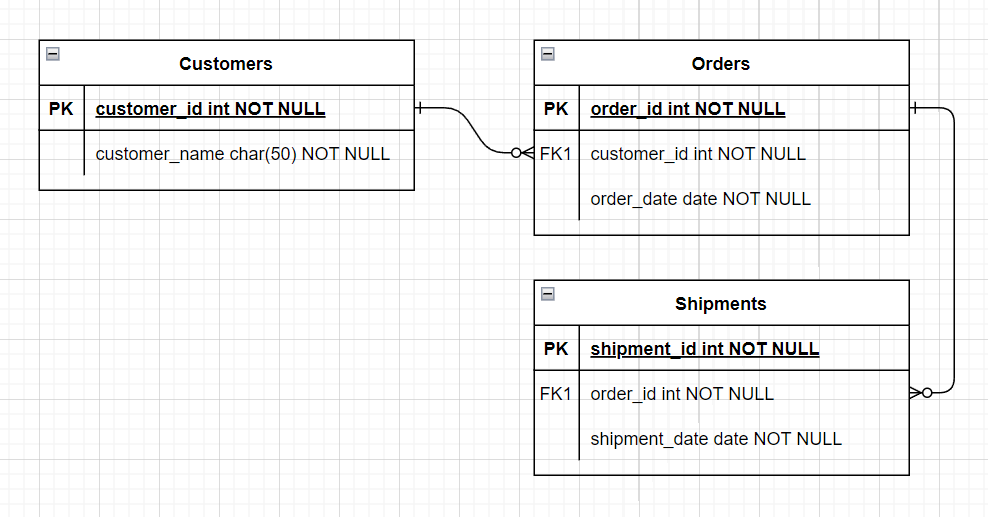

# 4.2 ERD and Normalization Process

- [4.2.1 ERD의 중요성](#421-erd의-중요성)
- [4.2.2 예제로 배우는 ERD](#422-예제로-배우는-erd)
- [4.2.3 정규화 과정](#423-정규화-과정)
  - [정규형 원칙](#정규형-원칙)
  - [제1정규형](#제1정규형)
  - [제2정규형](#제2정규형)
  - [제3정규형](#제3정규형)
  - [보이스/코드 정규형](#보이스코드-정규형)

 

---

# 4.2.1 ERD의 중요성
- ERD : Entity Relationship Diagram. 릴레이션간의 관계 정의.
- ERD를 기반으로 데이터베이스를 구축하며, 디버깅이나 프로세스 재설계가 필요한 경우에 설계도 역할을 한다.
- 단점 : 비정형 데이터를 충분히 표현할 수 없다.
  - 비정형 데이터 : 비 구조화 데이터를 말하며, 미리 정의된 데이터 모델이 없거나, 정의된 방식으로 정지되지 않은 정보를 의미.

 

---

# 4.2.2 예제로 배우는 ERD

 

---

# 4.2.3 정규화 과정
- 데이터베이스 이상 현상 : 릴레이션 간 잘못된 종속 관계가 발생.
- 정규화 과정 : 정규형 원칙을 기반으로 정규형을 만들어가는 과정. 정규화 정도는 정규형(NF, Normal Form)으로 표현

## 정규형 원칙
- 좋은 구조 지향
- 자료 중복성 감소
- 독립적인 관계는 별개의 릴레이션으로 표현
- 각각의 릴레이션은 독립적인 표현이 가능해야 하는 것

## 제1정규형
- 릴레이션의 모든 도메인이 분해될 수 없는 원자 값(atomic value)만으로 구성되어야 한다.
  - 반복 집합이 있다면 제거해야 한다.

## 제2정규형
- 릴레이션이 제1정규형이며 부분 함수의 종속성을 제거한 형태를 의미
- **부분 함수의 종속성 제거** : 기본키가 아닌 모든 속성이 기본키에 완전 함수 종속적인 것을 의미.

## 제3정규형
- 제2정규형이고 기본키가 아닌 모든 속성이 이행적 함수 종속(transitive FD)을 만족하지 않는 상태.

### 이행적 함수 종속
- A --> B와 B --> C면 A --> C 인데, 집합 C가 집합 A에 이행적으로 함수 종속이 되었다고 한다.

## 보이스/코드 정규형
- 보이스/코드(BCNF)는 제3정규형이고, 결정자가 후보키가 아닌 함수 종속 관계를 제거함. 릴레이션의 함수 종속 관계에서 모든 결정자가 후보키인 상태를 의미.
  - 결정자 : 함수 종속 관계에서 특정 종속자(dependent)를 결정짓는 요소 (ex. A(결정자) --> B(종속자))

